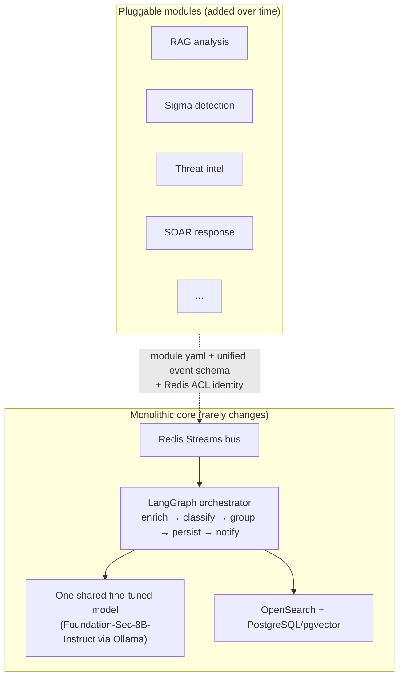
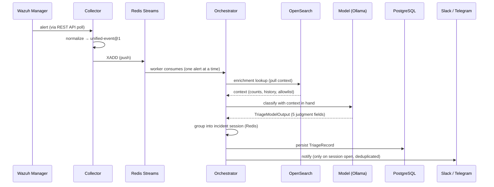
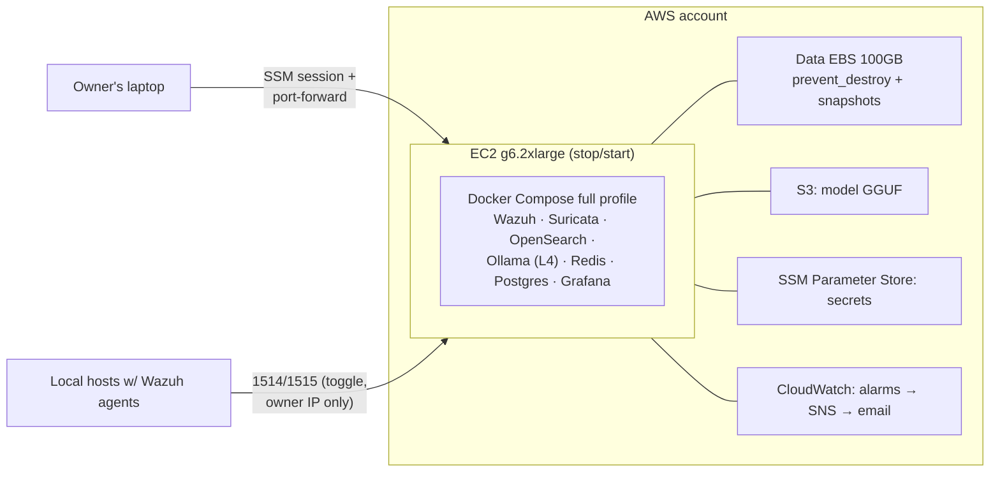
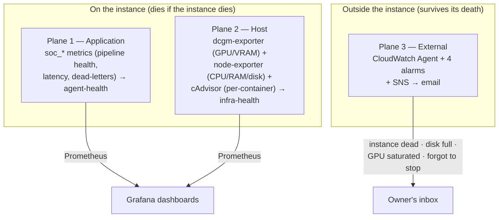

# SOC-AI

**A Security Operations Center with an AI triage brain — self-hostable, privacy-first, and built to grow one module at a time.**

SOC-AI reads the alerts your SIEM and IDS already produce and does the tedious first pass a human analyst would: it enriches each alert with context, decides whether it is `noise`, `informational`, or a real `alert`, folds a burst of related events into a single incident, and sends you *one* enriched notification in chat — instead of leaving you to stare at a dashboard full of raw alerts.

The inference runs **locally**, on your own hardware or your own cloud instance. Your logs never leave your environment.

> **Status:** Phase 1 (monitoring + triage), early development. The design is mature, the core is built and green; the two remaining Phase-1 blockers are the fine-tuned model and the cloud provisioning. See [Current status](#current-status).
>
> Maintainer: [@TacosConChelas](https://github.com/TacosConChelas)

---

## Table of contents

- [The problem it solves](#the-problem-it-solves)
- [Philosophy: monolith + modules](#philosophy-monolith--modules)
- [How it works](#how-it-works)
- [Modules](#modules)
- [Infrastructure & deployment](#infrastructure--deployment)
- [Why the cloud](#why-the-cloud)
- [Observability](#observability)
- [Security model](#security-model)
- [Technology stack](#technology-stack)
- [Current status](#current-status)
- [Roadmap: how it evolves](#roadmap-how-it-evolves)
- [License](#license)

---

## The problem it solves

A small security team — or a single person running their own lab — drowns in alerts. A SIEM like Wazuh plus a network IDS like Suricata will happily generate thousands of events a day, most of them noise, a few of them the thing that actually matters. Reading them one by one does not scale, and the important signal hides in the volume.

SOC-AI puts a **fine-tuned language model** between the flood of alerts and the human. For every alert it:

1. **Enriches** it — how many times has this source IP appeared before? how many distinct rules did it trip in the last 24h? is it on the allowlist?
2. **Classifies** it — `noise` (filtered away), `informational` (logged, low priority), or `alert` (a human should look).
3. **Groups** it — a brute-force run of 200 login attempts becomes *one* incident, not 200 notifications.
4. **Notifies** — a single, structured message with the model's reasoning and suggested next actions, delivered to Slack or Telegram.

The result: a human reads **incidents**, not raw logs.

---

## Philosophy: monolith + modules

SOC-AI is deliberately **not** a microservices swarm, and deliberately **not** a monolith that has to be rewritten to grow. It is a **solid monolithic core plus pluggable modules** — a maturity model where each module raises the SOC's level.



Two principles hold this together:

**One shared brain, not one model per tool.** However many detection sources or modules exist, they all normalize their output to a single **unified event schema** *before* the model sees it. The model never sees a raw tool format. This means the SOC gets smarter by improving one model, not by juggling a zoo of them — and it fits comfortably in a single GPU.

**A module is a contract, not a fork.** Any new capability ships as a module that: declares itself in a `module.yaml`, normalizes its data to the unified event schema, registers its capabilities with the orchestrator, and talks over the Redis bus with its own authenticated identity. The core does not need to know a module exists ahead of time — it needs the module to honor the contract. That is what lets the project grow without destabilizing what already works.

The **module catalog is the roadmap** (see [Roadmap](#roadmap-how-it-evolves)).

---

## How it works

The heart of the system is a **LangGraph supervisor** — a controlled state graph, not an autonomous agent swarm. A representative alert flows through it like this:



A few design rules that define the system's behavior:

- **The model only produces judgment.** It emits 5 fields — `classification`, `confidence`, `summary`, `suggested_actions`, `rationale`. Everything deterministic (`severity`, `incident_group_key`, `context`) is computed by the code, never by the model. This keeps the model's job small and testable.
- **Enrichment runs before classification.** The model always decides *with* context, never blind.
- **Grouping is session-based.** An incident is a live session in Redis, keyed by `src_ip + matched_rule`, opened on the first alert and closed after 5 minutes of inactivity. A continuous burst is one incident; a fresh burst later is a new one.
- **Fail loud, never silent.** A model failure, an unreachable enrichment store, a queue backup — all degrade *noisily* with a system notification and a metric. A checkpoint guarantees no event is silently lost. Wazuh is the source of truth.
- **Alert content is data, never instructions.** The model is trained and prompted to treat the content of an alert as something to classify, never as instructions to obey — the anti-prompt-injection stance lives in the weights, not just the prompt.

---

## Modules

Modules are how SOC-AI grows. Each one is a self-contained capability that attaches to the core through the module standard. A module declares its `kind`:

| Kind | Publishes events? | Exposes capabilities? | Example |
|------|-------------------|-----------------------|---------|
| `source` / `detector` | Yes (with a normalizer) | Optional | A new IDS feeding the bus |
| `enricher` | Optional | Yes (queried by the agent) | Threat-intel lookup |
| `agent` | Optional | Yes | A specialist reasoning module |
| `responder` | No | Yes (actions) | SOAR host-isolation |

Every module ships the same four things: a `module.yaml` manifest, a normalizer to the unified event schema (if it produces events), a capability registration with the orchestrator, and communication over Redis (events) or tool-call (invocations). None are built yet in Phase 1 — the standard exists, the catalog is the roadmap.

### Modules can live off-instance

A capability doesn't have to run on the same host as the core. Two patterns are supported by design:

- **Honeypots as a Wazuh log source (recommended).** For sensor-like sources such as honeypots ([Conpot](http://conpot.org/), Cowrie, Dionaea), the recommended pattern is *not* to connect them directly to the bus, but to have them forward logs to the Wazuh Manager like any other agent, with a lightweight normalizer inside the SOC translating their fields to the unified schema. The honeypot never needs to touch Redis, never needs cloud credentials — it just produces logs, which is what honeypots are built to do.
- **Genuinely remote modules.** A module that must publish to the bus or expose invokable capabilities from a separate host can do so either inside the same cloud VPC (low latency, ACL auth is sufficient) or from a local machine over the internet (mandatory mutual-TLS with client certificates). Both paths are documented; neither is provisioned until a concrete module needs it.

---

## Infrastructure & deployment

SOC-AI runs on **Docker Compose** with two profiles:

- **`light`** — Wazuh + Suricata + OpenSearch. Passive monitoring, no GPU needed. Runs on modest hardware.
- **`full`** — everything: the AI agent, Ollama, Redis, PostgreSQL, Grafana, notifications, and the host-observability exporters.

The reference deployment is a single **AWS EC2 `g6.2xlarge`** provisioned entirely as code with **Terraform**:

| Resource | Spec |
|----------|------|
| Instance | `g6.2xlarge` — 1× NVIDIA L4 (24 GB VRAM), 8 vCPU, 32 GB RAM |
| Base image | AWS Deep Learning AMI (GPU) — NVIDIA drivers pre-installed |
| Root volume | Encrypted EBS gp3 (~30 GB) — OS + Docker, disposable |
| Data volume | Encrypted EBS gp3 (100 GB), `prevent_destroy` — Postgres, OpenSearch indices, the model GGUF |
| Backups | Automated DLM incremental snapshots of the data volume |
| Model storage | S3 bucket (encrypted, versioned) for the GGUF artifact |
| Secrets | AWS SSM Parameter Store (SecureString + KMS) |
| Access | AWS SSM Session Manager — **zero inbound ports** |



**The instance is cattle; the data volume is a pet.** The EC2 can be recreated painlessly — everything special about it is reinstalled by Terraform. The data volume is sacred: separate from the root disk, guarded with `prevent_destroy` so not even an accidental `terraform destroy` can take it, and backed by automated snapshots.

**Deployment is owner-operated on a stop/start lifecycle.** Terraform provisions the infrastructure; it does not start the stack. The owner brings the instance up for a working session, runs the stack over an SSM shell, and powers it off afterward. Compute is billed only during sessions.

```bash
./infra/scripts/aws-start.sh                    # power on, wait for SSM
aws ssm start-session --target <instance-id>    # shell — no open ports
./infra/scripts/fetch-secrets.sh                # Parameter Store → mounted secrets
docker compose --profile full up -d             # bring up the stack
./infra/scripts/ssm-tunnel.sh                   # dashboards on localhost
# ... work ...
docker compose down && ./infra/scripts/aws-stop.sh
```

---

## Why the cloud

SOC-AI started as a local project on a laptop GPU. Moving the reference deployment to AWS was a deliberate trade-off, made for concrete reasons:

- **The GPU budget tripled.** The laptop's 8 GB of VRAM forced a small 3.8B model and CPU-only embeddings. An NVIDIA L4 with 24 GB lets the SOC run a security-specialized 8B model with ~17 GB of headroom to spare — room for a better model *and* future modules.
- **Pay only for what you use.** A stop/start lifecycle means the expensive GPU is billed only during the ~7h/week the SOC is actually in use. The cost lands at roughly **$42–46/month**, dominated by GPU-hours; only ~$13/month is fixed storage that persists whether the instance is on or off.
- **Portless, IP-agnostic access.** Administrative access is exclusively through AWS SSM Session Manager — an outbound-only encrypted channel that needs no open inbound ports and no static IP. This solves a real problem (the owner's IP changes between locations) while drastically shrinking the attack surface: the Security Group has **zero inbound ports** by default.
- **Durable persistence, cheaply.** Encrypted EBS with `prevent_destroy` and automated snapshots delivers the owner's hard requirement — *never lose anything* — without running backup infrastructure.

None of this is locked in: the `light` profile still runs anywhere, and the whole stack is Docker Compose, so a self-hoster with a capable GPU can run SOC-AI on their own metal without the cloud pieces. The AWS layer is the *reference* deployment, not a hard dependency.

---

## Observability

Because the SOC watches other systems, it must be watchable itself — and, crucially, it must be able to tell you when it has *died*. That requires monitoring that outlives the thing it monitors, so observability is split into **three planes**:



- **Plane 1 (application)** — the pipeline's own `soc_*` metrics: throughput, inference latency against the 3-second budget, dead-letter counts, enrichment failures. Surfaced in the `agent-health` Grafana dashboard.
- **Plane 2 (host)** — GPU/VRAM, host CPU/RAM/disk, and per-container usage, via the official NVIDIA `dcgm-exporter`, `node-exporter`, and `cAdvisor`. Surfaced in the `infra-health` dashboard. This plane matters because on a single instance, System RAM (32 GB shared across OpenSearch, Ollama, Postgres, Redis, and the exporters) is the real contended resource — `cAdvisor` shows who is eating it.
- **Plane 3 (external)** — the plane that **survives the instance**. A CloudWatch Agent running as a host service (outside Docker, so it doesn't die with the stack) drives four alarms — instance down, disk ≥ 85%, GPU saturated, forgot-to-stop reminder — that reach the owner by email through SNS.

The channel split is semantic and deliberate: **Slack/Telegram = what happens *inside* the SOC** (incidents, pipeline failures the pipeline can still report); **email = what happens *to* the SOC** (the instance itself is down). When an email arrives instead of a Slack message, you know without reading it that the problem is infrastructure, not a security alert. A monitoring system that dies together with the thing it monitors is useless for its most important job — telling you it went down.

---

## Security model

The system is defended in **four concentric rings**, each independent — a failure in one does not collapse the others:

| Ring | Boundary | Mechanism |
|------|----------|-----------|
| **Ring 1** | Inside the host | Per-module Redis ACL identities + Docker network segmentation + mounted secrets (the bus-authentication layer) |
| **Ring 2** | Network perimeter | AWS Security Group with zero inbound ports; access exclusively via SSM |
| **Ring 3** | Identity & secrets | Instance IAM role (no static keys) + SSM Parameter Store for all secrets |
| **Ring 4** | Data at rest | One KMS key encrypting EBS, snapshots, S3, and secrets |

Beyond the rings, three invariants hold everywhere: inference is **local** (production logs never leave the VPC), **alert content is treated as data and never as instructions** (anti-prompt-injection defended in the model's weights), and **raw model output never travels in a notification or a log** (a malformed response is potentially attacker-influenced text, so quoting it would open an exfiltration channel).

---

## Technology stack

| Category | Technology |
|----------|-----------|
| AI orchestration | LangGraph (supervisor pattern) + LangChain |
| LLM | Foundation-Sec-8B-Instruct (fine-tuned, GGUF/Q4_K_M) via Ollama, CUDA on NVIDIA L4 |
| Fine-tuning | QLoRA + Unsloth on Google Colab → llama.cpp export → S3 |
| API framework | FastAPI (async) |
| HIDS / log collection | Wazuh Agent / Filebeat |
| Network IDS | Suricata (Emerging Threats rules, EVE JSON) |
| SIEM / correlation | Wazuh Manager |
| Search / operational store | OpenSearch (Wazuh Indexer) |
| State + vectors | PostgreSQL + pgvector |
| Message bus | Redis Streams |
| Dashboards | Grafana (`agent-health`, `infra-health`) + Wazuh Dashboard |
| Notifications | Slack / Telegram (incidents) + AWS SNS → email (infra alarms) |
| Host observability | dcgm-exporter · node-exporter · cAdvisor |
| Container platform | Docker Compose (profiles: `light`, `full`) |
| Cloud | AWS EC2 · EBS · S3 · IAM · KMS · SSM · CloudWatch · SNS · EventBridge |
| Infrastructure as Code | Terraform |

Everything operationally critical is open source with a permissive license. The proprietary touchpoints — Slack, Telegram, and the AWS services — are *consumed*, not redistributed, and none contaminate the stack's open-source posture.

---

## Current status

> Don't assume things exist — this is the honest state of development.

- **Design** — mature and coherent. The full design (architecture, contracts, decision records, training and deployment plans) is authoritative and internally consistent.
- **Core code** — **complete and green**. Contracts, the anti-injection system prompt, the four pipeline nodes, the supervisor graph, the bus, the Wazuh collector, and the Prometheus instrumentation are all built; the unit suite, linting (`ruff`), and strict type-checking (`mypy`) are clean repo-wide under CI. The pipeline has run end-to-end, persisting triage records.
- **Two parallel blockers remain for Phase 1:**
  1. **The training pipeline** — the fine-tuned model. Not yet built: a base model without fine-tuning emits invalid JSON, which the strict output gate correctly dead-letters. The fine-tune is what unblocks triage *quality*.
  2. **The AWS provisioning** — the Terraform infrastructure. Not yet provisioned; the prerequisite (an AWS account with an IAM user and MFA) is the first step.
- **Observability** — Plane 1 is built; Planes 2 and 3 are specified but not yet implemented.
- **Modules** — none built yet. The standard exists; the catalog is the roadmap below.

---

## Roadmap: how it evolves

SOC-AI is designed as a maturity model, not a finished product. Phase 1 delivers a solid core; every later level is a module that attaches to it through the standard.

| Level | Capability | What it adds |
|-------|-----------|--------------|
| **1 — current** | Monitoring & triage | Centralized ingest, network IDS, AI classification, enrichment, grouping, notifications, dashboards |
| **RAG analysis** | Deep semantic explanation | Enriches an alert's reasoning with knowledge (CVE / ATT&CK / playbooks) over pgvector, for the alerts that survive triage — without changing the output schema |
| **Sigma detection** | Detection as code | Versioned detection rules with explicit ATT&CK coverage (Sigma + pySigma) |
| **AI-driven rule generation** | The SOC writes its own rules | The agent drafts and validates new Sigma rules — closing the detection loop |
| **Threat intelligence** | Risk scoring | CVSS + EPSS + KEV enrichment from free NVD/CISA feeds |
| **Response (SOAR)** | Automated action | Moves the SOC from *detection* to *response* — isolate a host, block an IP |

Each level reuses the same shared model and the same bus; none requires rewriting the core. That is the whole point of the monolith-plus-modules design: the SOC gets more capable by accretion, not by replacement.

Explicitly **out of scope for Phase 1** (and pushed to later levels): active/automated response, predictive or anomaly-based detection, semantic RAG, and any module at all. Phase 1 is about getting the core right.

---

## License

The operational core is built on open-source components that permit commercial use at no licensing cost. See the individual components for their respective licenses; the notification and cloud services (Slack, Telegram, AWS) are consumed under their own terms and are replaceable by open-source or self-hosted alternatives.

---

*SOC-AI is built by [@TacosConChelas](https://github.com/TacosConChelas)*
